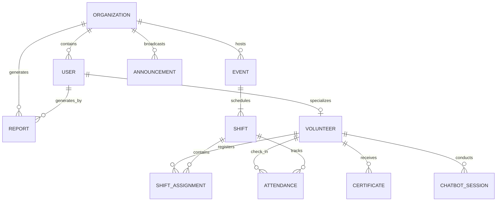

# Volunteer Management System (VMS) - SaaS Enterprise Master Plan & Roadmap

This document serves as the master blueprint and tracking ledger for the development of the Volunteer Management System (VMS), a multi-tenant, role-based, SaaS-level enterprise platform designed to coordinate volunteer operations.

---

## 🚀 1. Architectural Blueprint (Enterprise-Grade SaaS)

To scale this platform for huge non-profits, multinational NGOs, and governmental bodies, we will design the system around the **Model-View-Controller (MVC)** architectural pattern, leveraging **Laravel 10+/11**, **MySQL**, **Redis**, and **Laravel Livewire** (coupled with **Alpine.js** and **Tailwind CSS** for real-time reactivity without the overhead of heavy SPAs).

### 🛡️ Multi-Tenancy Architecture
We will implement **Single-Database Multi-Tenancy (Logical Isolation)**:
*   Every table (except system-wide tables) will have an `org_id` column.
*   We will implement a Laravel Global Query Scope (`App\Models\Scopes\TenantScope`) that automatically scopes all queries by the authenticated user's `org_id`.
*   A `TenantMiddleware` will resolve the current tenant from the sub-domain, custom domain, or session, and set a global tenant manager helper.
*   No developer should ever have to manually append `where('org_id', ...)` to queries—this is enforced dynamically at the Eloquent base model level.

### 👥 Hierarchical Role-Based Access Control (RBAC)
We will implement four distinct user roles:
1.  **General System Admin (Super Admin):** Manages overall platform health, billing/tiers, registers new organizations, and manages global metrics.
2.  **Organization Admin (Tenant Admin):** Manages organizational settings, branding, registers and assigns permissions to Volunteer Coordinators, and views organization-level analytics.
3.  **Volunteer Coordinator:** Creates events, builds shift schedules, reviews/approves volunteer applications, verifies QR/GPS attendance, posts announcements, and generates certificates.
4.  **Volunteer:** Manages profile (skills, availability, bio), searches/registers for shifts, performs QR check-in/out, queries the AI chatbot, and downloads PDF certificates.

### 🧠 Intelligent Assistant Subsystem (Gemini API Integration)
Instead of a simple static bot, the AI Chatbot will be integrated directly with the database context:
*   When a volunteer asks, "When is my next shift?" the system will query the active session, fetch the volunteer's upcoming shift assignments, format them as a structured schema, and pass it as system context to the **Gemini API** along with the prompt.
*   This ensures the AI responds with 100% accurate, personalized, and real-time data from the VMS.
*   The conversation session state will be cached in Redis and stored persistently in `chatbot_sessions` for continuity.

### 📍 QR-Code & Geolocation Verification
*   **QR Code:** When a shift is active, the system generates a signed, time-limited QR code.
*   **GPS Geo-Fence:** When a volunteer scans the QR, the browser's Geolocation API captures their precise latitude and longitude.
*   The server calculates the **Haversine Distance** between the volunteer's current coordinates and the event location. If the distance is within the allowed radius (e.g., 100 meters) and the timestamp falls within the shift window (plus buffer), attendance is marked as "Verified". Otherwise, a location/temporal error is thrown.

---

## 🗄️ 2. Database Schema (Enterprise Relational Design)

We will implement a strictly normalized schema (up to 3NF) with indexes on all foreign keys, status columns, and search parameters.



### Relational Table Definitions

1.  **organizations**
    *   `id` (PK) | `name` (VARCHAR 150) | `email` (VARCHAR 100, UNIQUE) | `address` (VARCHAR 255) | `status` (ENUM: active, suspended) | `created_at` | `updated_at`
2.  **users**
    *   `id` (PK) | `org_id` (FK -> organizations, nullable for Super Admins) | `full_name` (VARCHAR 100) | `email` (VARCHAR 100, UNIQUE) | `password` (VARCHAR 255) | `role` (ENUM: SuperAdmin, OrgAdmin, Coordinator, Volunteer) | `last_login` | `created_at` | `updated_at`
3.  **volunteers**
    *   `id` (PK) | `user_id` (FK -> users, UNIQUE) | `skills` (JSON / TEXT) | `availability` (JSON / TEXT) | `total_hours` (DECIMAL 8,2) | `impact_score` (DECIMAL 5,2) | `bio` (TEXT) | `created_at` | `updated_at`
4.  **events**
    *   `id` (PK) | `org_id` (FK -> organizations) | `title` (VARCHAR 150) | `description` (TEXT) | `location` (VARCHAR 255) | `latitude` (DECIMAL 9,6) | `longitude` (DECIMAL 9,6) | `start_date` | `end_date` | `status` (ENUM: upcoming, ongoing, completed) | `created_at` | `updated_at`
5.  **shifts**
    *   `id` (PK) | `event_id` (FK -> events) | `start_time` (DATETIME) | `end_time` (DATETIME) | `required_skills` (JSON / TEXT) | `capacity` (INT) | `qr_code_signature` (VARCHAR 255) | `created_at` | `updated_at`
6.  **shift_assignments**
    *   `id` (PK) | `shift_id` (FK -> shifts) | `volunteer_id` (FK -> volunteers) | `status` (ENUM: pending, confirmed, cancelled) | `assigned_at` | `created_at` | `updated_at`
7.  **attendances**
    *   `id` (PK) | `shift_id` (FK -> shifts) | `volunteer_id` (FK -> volunteers) | `check_in_time` (TIMESTAMP) | `check_out_time` (TIMESTAMP, NULLABLE) | `qr_verified` (BOOLEAN) | `latitude` (DECIMAL 9,6, NULLABLE) | `longitude` (DECIMAL 9,6, NULLABLE) | `created_at` | `updated_at`
8.  **certificates**
    *   `id` (PK) | `volunteer_id` (FK -> volunteers) | `org_id` (FK -> organizations) | `issued_date` | `milestone_hours` (DECIMAL 8,2) | `file_path` (VARCHAR 255) | `created_at` | `updated_at`
9.  **reports**
    *   `id` (PK) | `org_id` (FK -> organizations) | `generated_by` (FK -> users) | `period` (VARCHAR 50) | `total_volunteers` (INT) | `total_hours` (DECIMAL 10,2) | `file_path` (VARCHAR 255) | `created_at` | `updated_at`
10. **announcements**
    *   `id` (PK) | `org_id` (FK -> organizations) | `posted_by` (FK -> users) | `title` (VARCHAR 150) | `message` (TEXT) | `target_audience` (ENUM: all, coordinators, volunteers) | `created_at` | `updated_at`
11. **chatbot_sessions**
    *   `id` (PK) | `volunteer_id` (FK -> volunteers) | `started_at` | `last_interaction` | `context_data` (TEXT/JSON) | `created_at` | `updated_at`

---

## 📅 3. Phased Implementation Roadmap & Progress Tracker

This checklist will serve as our long-term roadmap. We will check off tasks sequentially.

### 🟥 PHASE 1: System Scaffolding & Core Architecture Setup
*   [ ] Task 1.1: Install Laravel 10/11, Livewire, Alpine.js, Tailwind CSS, and necessary packages (DomPDF, Laravel Sanctum).
*   [ ] Task 1.2: Set up Git version control and verify structure.
*   [ ] Task 1.3: Draft and execute all Database Migrations with foreign key constraints, indexes, and soft deletes.
*   [ ] Task 1.4: Implement Multi-Tenant isolation: Create `TenantScope` and configure `TenantMiddleware`.
*   [ ] Task 1.5: Set up Eloquent Relationships, Factories, and seeders (including organizational data, users of all 4 roles).

### 🟨 PHASE 2: Enterprise Authentication & Onboarding Module
*   [ ] Task 2.1: Implement Secure Sign-Up and Profile Registration for Volunteers (skills, availability, documents upload).
*   [ ] Task 2.2: Implement Login engine supporting session/token-based authentication (Laravel Sanctum) with multi-role redirection.
*   [ ] Task 2.3: Build role-based route middleware to protect endpoints (`SuperAdmin`, `OrgAdmin`, `Coordinator`, `Volunteer`).
*   [ ] Task 2.4: Create the tenant onboarding flow where Super Admins can instantiate a new organization workspace.

### 🟩 PHASE 3: Tenant Dashboard, Event, & Shift Management
*   [ ] Task 3.1: Build Organization Admin Dashboard to manage Volunteer Coordinators and view consolidated analytics.
*   [ ] Task 3.2: Build Volunteer Coordinator Dashboard to manage events (Create, Edit, Delete, Publish) and schedule shifts.
*   [ ] Task 3.3: Implement shift capacity limits, required skills listing, and automatic conflict detection (alerting if shifts overlap).
*   [ ] Task 3.4: Build Volunteer Self-Service Portal (browsing events, filtering by match score, applying for shifts, viewing schedule).
*   [ ] Task 3.5: Implement Volunteer Coordinator application review board (approving, rejecting, verifying credentials).

### 🟦 PHASE 4: QR-Code Check-In & Geolocation Geofencing
*   [ ] Task 4.1: Integrate QR code generation library for each shift.
*   [ ] Task 4.2: Build client-side camera scanner interface (using HTML5/JS camera API inside Livewire) for Volunteers.
*   [ ] Task 4.3: Incorporate Browser Geolocation API to capture latitude and longitude at the moment of scanning.
*   [ ] Task 4.4: Implement server-side Haversine validation logic: check QR signature, verify geofence (within 100m), and ensure timestamp matches shift boundaries.
*   [ ] Task 4.5: Design double-entry check-in/out logging (storing check-in time, calculating duration upon check-out, and auto-updating `total_hours`).

### 🟪 PHASE 5: AI-Powered Chatbot & Natural Language Query System
*   [ ] Task 5.1: Integrate Gemini API client into the Laravel backend.
*   [ ] Task 5.2: Create contextual query builder: intercept prompts, query database for volunteer's schedule/hours/milestones, format as JSON prompt metadata, and dispatch to Gemini.
*   [ ] Task 5.3: Build live, responsive Chatbot interface component in Livewire with typewriter effects and chat history caching (Redis-powered).
*   [ ] Task 5.4: Test chatbot handling of complex queries (e.g., "Am I scheduled for teaching tomorrow?", "How many hours do I need for my next certificate?").

### 🟧 PHASE 6: Automated Reporting, Certificate Generation, & urgent broadcasts
*   [ ] Task 6.1: Build PDF certificate generation engine (using DomPDF) triggered automatically when `total_hours` cross thresholds (e.g., 20h, 50h, 100h).
*   [ ] Task 6.2: Create Organization Impact Reporting Engine (charts, summaries of volunteer participation, total hours logged, exportable CSV/PDF reports for donors).
*   [ ] Task 6.3: Implement Urgent Shift Broadcast System: allow coordinators to select an empty shift and instantly broadcast alerts via SMS/Email to available volunteers with matching skills.

### 🟫 PHASE 7: Verification, Rigorous Testing, & Production-Ready Optimization
*   [ ] Task 7.1: Write comprehensive Unit and Integration tests using PHPUnit for authentication, tenant isolation, and geolocation validation.
*   [ ] Task 7.2: Write End-to-End tests using Laravel Dusk to verify critical user paths (Volunteer application -> Coordinator approval -> QR scan check-in -> Certificate generation).
*   [ ] Task 7.3: Conduct performance optimization: implement Redis caching for dashboards, add database query optimization, compile assets via Vite.
*   [ ] Task 7.4: Finalize platform documentation and handoff guides.

---

## 🛠️ 4. Directory Structure Schema

To maintain professional, enterprise-grade separation of concerns:

```
app/
├── Models/
│   ├── Scopes/
│   │   └── TenantScope.php         <-- Auto-injects tenant constraints globally
│   ├── Organization.php
│   ├── User.php
│   ├── Volunteer.php
│   ├── Event.php
│   ├── Shift.php
│   ├── ShiftAssignment.php
│   ├── Attendance.php
│   ├── Certificate.php
│   ├── Report.php
│   └── Announcement.php
├── Http/
│   ├── Middleware/
│   │   ├── TenantMiddleware.php    <-- Resolves and registers current tenant
│   │   └── CheckRole.php           <-- Core RBAC authorization gate
│   └── Livewire/                   <-- Full-stack reactive Livewire components
│       ├── Auth/
│       │   ├── Login.php
│       │   └── Register.php
│       ├── Volunteer/
│       │   ├── Dashboard.php
│       │   ├── EventList.php
│       │   ├── QRScanner.php
│       │   └── Chatbot.php
│       ├── Coordinator/
│       │   ├── Dashboard.php
│       │   ├── EventManager.php
│       │   ├── ApplicationsReview.php
│       │   └── BroadcastSystem.php
│       └── Admin/
│           ├── TenantManager.php
│           └── AnalyticalReports.php
```

---

## 📈 5. Maintenance & Progress Guidelines

1.  **Strict Phase Adherence:** We must never skip tasks or skip phases.
2.  **Ledger Maintenance:** Every time a phase is completed, we update the status checkbox `[ ]` to `[x]` in this master plan file.
3.  **No Shortcuts:** Code must be production-ready with full error handling, data validation, and logger coverage.

*Drafted on: June 10, 2026*
*Author: Core AI Architect*
