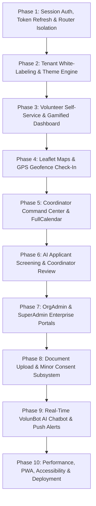

# 🎨 Enterprise Production-Ready Frontend Master Implementation Plan

> **Target Platform**: Volunteer Management System (VMS) — Production Enterprise Web Application  
> **Goal**: Transform the existing testing/demo frontend into a sleek, high-performance, white-labeled SaaS web application designed for real-world volunteers, coordinators, and administrators.

---

## 📐 Architecture & Technology Stack

| Layer | Production Technology | Description |
|---|---|---|
| **Core Framework** | React 18 + TypeScript | Type-safe, component-driven UI architecture. |
| **Build Tooling** | Vite 5 | Instant HMR, optimized production code-splitting & tree-shaking. |
| **Routing** | React Router v6 | Real URL routing (`/login`, `/dashboard`, `/events/:id`, `/admin`, `/certificates`). |
| **State & Cache** | TanStack Query (React Query v5) | Server state management, auto-refetching, offline mutation queues, optimistic updates. |
| **Styling & Design** | Tailwind CSS + Lucide Icons | Responsive modern design system with dynamic HSL theme tokens for tenant white-labeling. |
| **Maps & Geofencing** | Leaflet.js / React-Leaflet | Open-source interactive map rendering venue coordinates & 100m geofence overlays. |
| **Calendar & Scheduling** | FullCalendar React | Interactive month/week/day calendar for volunteer shift scheduling. |
| **Document Uploads** | React Dropzone | Drag-and-drop file upload interface with client-side file size & MIME validation. |
| **Notifications** | Sonner / React Hot Toast | Real-time toast alerts for broadcasts, approvals, and error handling. |
| **PWA & Offline** | Vite PWA Plugin + Workbox | Web App Manifest & service worker for offline shift viewing and mobile installation. |

---

## 🗺️ 10-Phase Master Implementation Roadmap



---

## 🚀 Phase 1: Session Auth, Token Refresh & React Router v6 Isolation

### 🎯 Objective
Replace the single-page tab switcher and debug role buttons with **real browser URL routing, Sanctum token persistence, HTTP 401 interceptors, and strict RBAC route guards**.

### Detailed Tasks
- [ ] Install and configure `react-router-dom` v6.
- [ ] Create explicit URL routes for all user flows:
  - `/login` — Sign In page
  - `/register` — Volunteer onboarding page
  - `/forgot-password` & `/reset-password` — Password recovery flow
  - `/public/verify/:certNumber` — Public certificate verification (no auth required)
  - `/volunteer/*` — Protected Volunteer workspace
  - `/coordinator/*` — Protected Coordinator workspace
  - `/admin/*` — Protected OrgAdmin workspace
  - `/superadmin/*` — Protected System Admin workspace
- [ ] Implement `useAuth` hook managing Sanctum bearer token in `localStorage` (`voluntrack_sanctum_token`).
- [ ] Create Axios / Fetch interceptor to capture HTTP 401 Unauthenticated responses and automatically redirect to `/login?session_expired=1`.
- [ ] Implement `ProtectedRoute.tsx` wrapper:
  ```tsx
  interface ProtectedRouteProps {
    allowedRoles: Array<'SuperAdmin' | 'OrgAdmin' | 'Coordinator' | 'Volunteer'>;
    children: JSX.Element;
  }

  export const ProtectedRoute: React.FC<ProtectedRouteProps> = ({ allowedRoles, children }) => {
    const { user, isAuthenticated, isLoading } = useAuth();

    if (isLoading) return <LoadingScreen />;
    if (!isAuthenticated) return <Navigate to="/login" replace />;
    if (!allowedRoles.includes(user.role)) return <Navigate to="/unauthorized" replace />;

    return children;
  };
  ```
- [ ] Remove debug role-switcher bar from top header and sidebar.

---

## 🎨 Phase 2: Tenant White-Labeling, Custom Domains & Dynamic Theme Engine

### 🎯 Objective
Enable each organization (e.g., Red Cross, Hope Food Relief) to display their **custom branding, logo, and primary color palette** dynamically based on tenant settings or subdomain.

### Detailed Tasks
- [ ] Implement subdomain auto-detection logic (`tenant.vms-platform.io` -> extracts slug `tenant`).
- [ ] Create `TenantThemeProvider.tsx` to inject HSL CSS variables into `:root`:
  ```tsx
  export const TenantThemeProvider: React.FC<{ children: React.ReactNode }> = ({ children }) => {
    const { currentOrg } = useTenant();

    useEffect(() => {
      if (currentOrg?.primary_color) {
        document.documentElement.style.setProperty('--primary', currentOrg.primary_color);
        document.documentElement.style.setProperty('--primary-hover', adjustBrightness(currentOrg.primary_color, -12));
      }
    }, [currentOrg]);

    return <>{children}</>;
  };
  ```
- [ ] Build branded header rendering organization logo (`logo_url` or SVG fallback badge).
- [ ] Add tenant primary color CSS utility classes (`bg-tenant-primary`, `text-tenant-primary`, `border-tenant-primary`).

---

## 🙋 Phase 3: Volunteer Self-Service & Gamified Dashboard

### 🎯 Objective
Build a clean, high-engagement dashboard for volunteers to track their service, view upcoming shifts, and explore skill-matched opportunities.

### Detailed Tasks
- [ ] **Hero Impact Banner**:
  - Total Verified Hours card.
  - Impact Score radial progress gauge (0 to 100).
  - Attendance Reliability percentage badge (`98%`).
- [ ] **Next Upcoming Shift Widget**:
  - Live countdown timer (`02 days 04 hours remaining`).
  - Event venue name, address, and 1-click check-in button (active within venue radius window).
- [ ] **Skill-Matched Opportunities Recommender**:
  - Filter shifts matching volunteer skills (`First Aid`, `Logistics`, `Teaching`).
  - Visual AI match score badge (`100% Match`, `75% Match`).
  - Shift application modal with availability check.
- [ ] **Milestone Hours Progress Wheel**:
  - Track hours towards 10h, 25h, 50h, 100h, 200h, 500h certificates.
  - Digital achievement badge gallery.

---

## 📍 Phase 4: Leaflet Maps & GPS Geofence Check-In

### 🎯 Objective
Replace numeric coordinate inputs with **Leaflet.js interactive maps** displaying venue markers, 100m geofence boundary circles, and live volunteer positioning.

### Detailed Tasks
- [ ] Install `leaflet` and `react-leaflet`.
- [ ] Create `GeofenceMap.tsx`:
  ```tsx
  import { MapContainer, TileLayer, Marker, Circle, Popup } from 'react-leaflet';

  export const GeofenceMap: React.FC<{
    venueLat: number;
    venueLng: number;
    radiusMeters: number;
    userLat?: number;
    userLng?: number;
  }> = ({ venueLat, venueLng, radiusMeters, userLat, userLng }) => {
    return (
      <MapContainer center={[venueLat, venueLng]} zoom={16} className="h-64 w-full rounded-lg border">
        <TileLayer url="https://{s}.tile.openstreetmap.org/{z}/{x}/{y}.png" />
        <Marker position={[venueLat, venueLng]}>
          <Popup>Event Venue (Geofence Center)</Popup>
        </Marker>
        <Circle center={[venueLat, venueLng]} radius={radiusMeters} pathOptions={{ color: '#4f46e5', fillColor: '#6366f1', fillOpacity: 0.2 }} />
        {userLat && userLng && (
          <Marker position={[userLat, userLng]}>
            <Popup>Your Location</Popup>
          </Marker>
        )}
      </MapContainer>
    );
  };
  ```
- [ ] Implement Geolocation API permissions handler (`navigator.geolocation.getCurrentPosition`).
- [ ] Add distance calculator feedback: `"You are 32 meters from venue — Inside Geofence ✓"`.
- [ ] Integrate `react-signature-canvas` for volunteer check-in digital signature capture.
- [ ] Build Check-Out summary modal displaying calculated hours worked and impact points gained.

---

## 📅 Phase 5: Coordinator Command Center & FullCalendar Integration

### 🎯 Objective
Equip coordinators with professional scheduling tools, interactive calendars, capacity meters, and urgent broadcast modals.

### Detailed Tasks
- [ ] Install `@fullcalendar/react`, `@fullcalendar/daygrid`, `@fullcalendar/timegrid`, and `@fullcalendar/interaction`.
- [ ] Create `EventCalendarView.tsx`:
  - Interactive month/week/day view of all shifts.
  - Drag-and-drop shift rescheduling.
  - Color-coded shift badges based on capacity status (Green = Available, Red = Full, Amber = Urgent).
- [ ] Event Creation Wizard:
  - Event title, category, description, venue search.
  - Geofence radius slider (50m to 500m).
  - Shift capacity & required skill multi-select tags.
- [ ] Urgent Shift Broadcast Modal:
  - Target shift selector.
  - Required skills auto-filter.
  - Broadcast trigger dispatches push notification to matching volunteers.

---

## 📋 Phase 6: AI Applicant Screening & Coordinator Review Workflow

### 🎯 Objective
Provide coordinators with automated applicant screening, AI feedback analysis, side-by-side candidate comparison, and force check-in overrides.

### Detailed Tasks
- [ ] Applicant Review Table:
  - Candidate name, email, hours logged, reliability history rate.
  - Matched skills badges (highlighting matches in green and missing in gray).
  - AI Match Score pill (`85% STRONG MATCH`).
- [ ] **AI Feedback Drawer**:
  - Displays strengths, missing prerequisite certifications (e.g. `Missing CPR Renewal`), and recommendation (`STRONG APPROVE`, `REVIEW CAREFULLY`).
- [ ] One-Click Decision Actions:
  - Approve candidate (`POST /api/coordinator/applications/{id}/approve`).
  - Decline candidate with custom feedback template (`POST /api/coordinator/applications/{id}/reject`).
- [ ] **Force Check-In Override Modal**:
  - Mandatory override reason text input (e.g., `"Volunteer GPS unavailable on device"`).
  - Submits to `POST /api/coordinator/applications/{id}/force-checkin` and logs audit entry.

---

## 🏢 Phase 7: OrgAdmin & SuperAdmin Enterprise Command Portals

### 🎯 Objective
Provide NGO leaders and Platform Administrators with workspace settings, staff creation, volunteer status management, and global audit logging.

### Detailed Tasks
- [ ] **OrgAdmin Workspace (`/admin/dashboard`)**:
  - Organization profile editor (Name, Email, Phone, Website, Subdomain, Primary Theme Color).
  - Coordinator Staff Creation Wizard (`POST /api/admin/coordinators`).
  - Member Directory with instant Volunteer Activation / Suspension toggles (`PATCH /api/admin/volunteers/{id}/status`).
- [ ] **SuperAdmin Console (`/superadmin/tenants`)**:
  - Executive Telemetry Cards: Total Organizations, Total Users, Total Verified Service Hours.
  - Provision Tenant Modal: Org Name, Admin Email, Password, Subscription Plan (`Free`, `Pro`, `Enterprise`).
  - Global Immutable SOC-2 Audit Trail Viewer with action filtering (`tenant.onboarded`, `attendance.force_checkin`, `tenant.suspended`).

---

## 📁 Phase 8: Document Upload, Verification & Minor Consent Subsystem (BR-02, BR-03)

### 🎯 Objective
Support file uploads for certifications, academic credentials, IDs, and **parental consent forms for minor volunteers (under 18)**.

### Detailed Tasks
- [ ] Install `react-dropzone` for drag-and-drop file uploads.
- [ ] Build `/volunteer/documents` screen:
  - File picker with MIME validation (PDF, PNG, JPEG) and 2MB file size guard.
  - Document type tag selector (`Certification`, `ID Proof`, `Parental Consent Form`, `Medical Clearance`).
  - Uploaded document list with status pills (`Pending Verification`, `Verified ✓`, `Rejected ❌`).
- [ ] **Minor Volunteer Consent Status Banner (BR-02)**:
  - If volunteer age < 18, render notice: `"Parental Consent Form Required before applying for active shifts."`
  - Disable shift application buttons until `parental_consent_verified` is true.
- [ ] **Coordinator Document Inspection Panel**:
  - View uploaded PDFs/images.
  - Verify document button -> sets document status to `verified` and auto-verifies minor consent flag.

---

## 🤖 Phase 9: Real-Time VolunBot AI Chatbot & Push Alerts Subsystem

### 🎯 Objective
Integrate Gemini AI chatbot with voice input support, localized context injection, and real-time toast alert broadcasts.

### Detailed Tasks
- [ ] **VolunBot Full Chat Screen (`/volunteer/chat`) & Floating Widget**:
  - RAG context injection engine (injecting volunteer name, org, hours, impact score, next shift, and milestone gap into Gemini API prompt).
  - Preset quick-prompt buttons:
    - `"When is my next shift?"`
    - `"How many hours to my next certificate?"`
    - `"How is my Impact Score calculated?"`
- [ ] **Voice / Speech Input Integration**:
  - Web Speech API integration (`webkitSpeechRecognition`) for hands-free voice query input.
- [ ] **Real-Time Notification Toast System**:
  - Configure `sonner` or `react-hot-toast` for shift application updates, broadcast alerts, and certificate issuance toasts.

---

## 📱 Phase 10: Performance Optimization, Offline PWA, Accessibility & Deployment

### 🎯 Objective
Prepare the application for production deployment with full mobile responsiveness, PWA support, Lighthouse 90+ audit scores, and optimized builds.

### Detailed Tasks
- [ ] **PWA & Offline Capability**:
  - Install `vite-plugin-pwa`.
  - Configure `manifest.json` (App name, short name, theme color, launcher icons 192x192 & 512x512).
  - Workbox service worker caching for offline shift viewing.
- [ ] **Performance Optimization**:
  - Implement React `lazy` & `Suspense` code-splitting per route.
  - Optimize bundle size (vendor chunk splitting for React, Leaflet, FullCalendar).
- [ ] **Accessibility (a11y) Audit**:
  - Ensure all form inputs have associated `<label>` tags.
  - ARIA attributes on interactive buttons and modals.
  - High-contrast color ratio compliance.
- [ ] **Production Build & Environment Config**:
  - `.env.production` setup (`VITE_API_BASE_URL=https://api.vms-platform.io/api`).
  - Production build script (`npm run build`).
  - Docker Nginx container setup for deployment.

---

## 📌 Comprehensive Development Timeline & Task Checklist

| Phase | Core Focus | Key Deliverable | Status |
|---|---|---|---|
| **Phase 1** | Session Auth & Routing | React Router v6, Sanctum token interceptors, ProtectedRoute. | 🟩 Ready for dev |
| **Phase 2** | White-Labeling | TenantThemeProvider, custom subdomain detection, CSS variables. | 🟩 Ready for dev |
| **Phase 3** | Volunteer Portal | Impact hero banner, next shift countdown, skill recommender. | 🟩 Ready for dev |
| **Phase 4** | Leaflet Maps & Geofence | Leaflet map container, 100m circle, signature pad, distance meter. | 🟩 Ready for dev |
| **Phase 5** | Coordinator Calendar | FullCalendar views, drag-and-drop shift scheduler, capacity badges. | 🟩 Ready for dev |
| **Phase 6** | AI Screening Review | AI feedback drawer, approve/decline templates, force check-in. | 🟩 Ready for dev |
| **Phase 7** | Enterprise Admin | OrgAdmin staff wizard, SuperAdmin tenant onboarding, SOC-2 audit logs. | 🟩 Ready for dev |
| **Phase 8** | Documents & Minor Consent | React Dropzone, 2MB guard, parental consent check (BR-02). | 🟩 Ready for dev |
| **Phase 9** | VolunBot AI & Voice | Context RAG engine, Web Speech API voice input, real-time alerts. | 🟩 Ready for dev |
| **Phase 10**| PWA & Production Deploy | PWA manifest, service worker, Lighthouse 90+, Docker container. | 🟩 Ready for dev |

---

*Master Frontend Implementation Plan created for seamless production transformation.*
